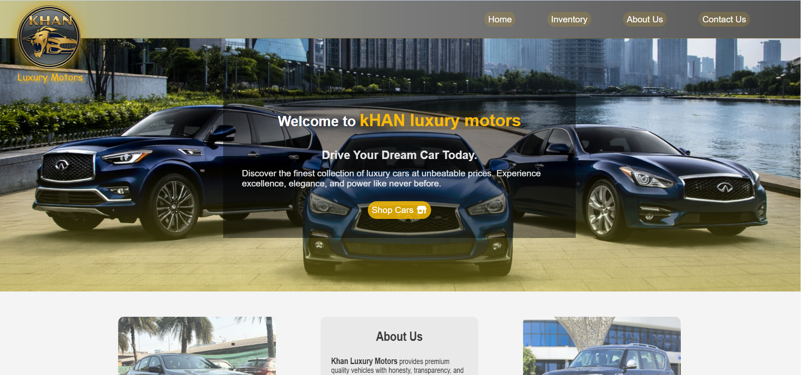
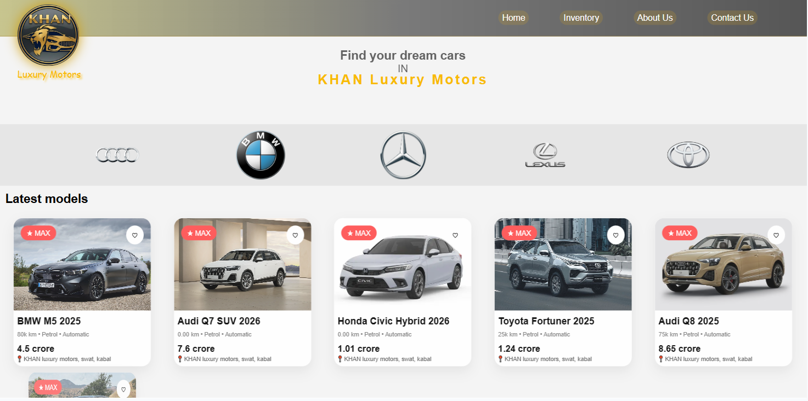
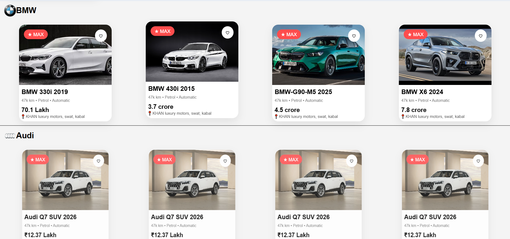
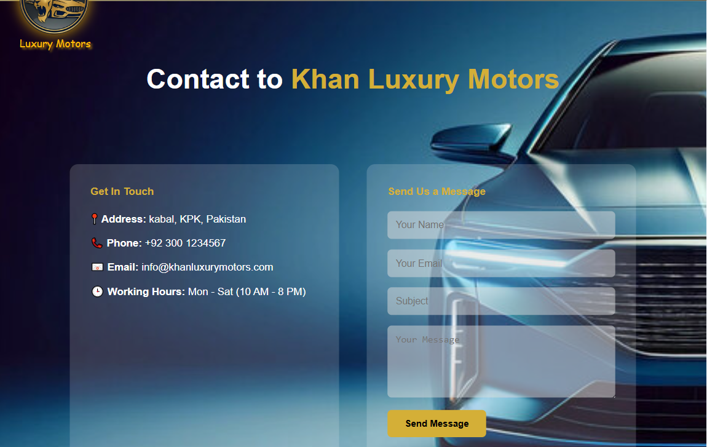
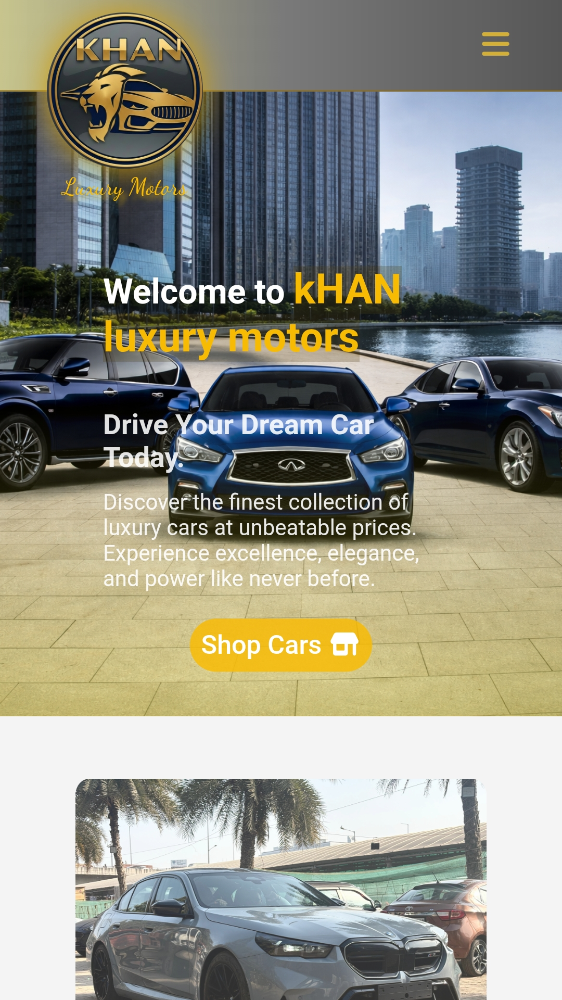
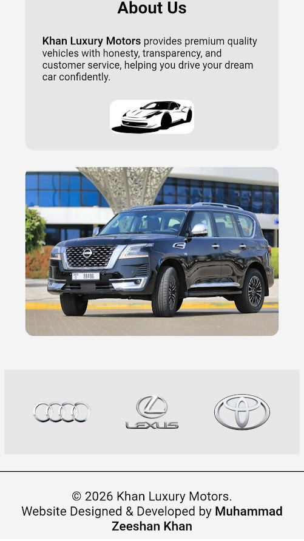
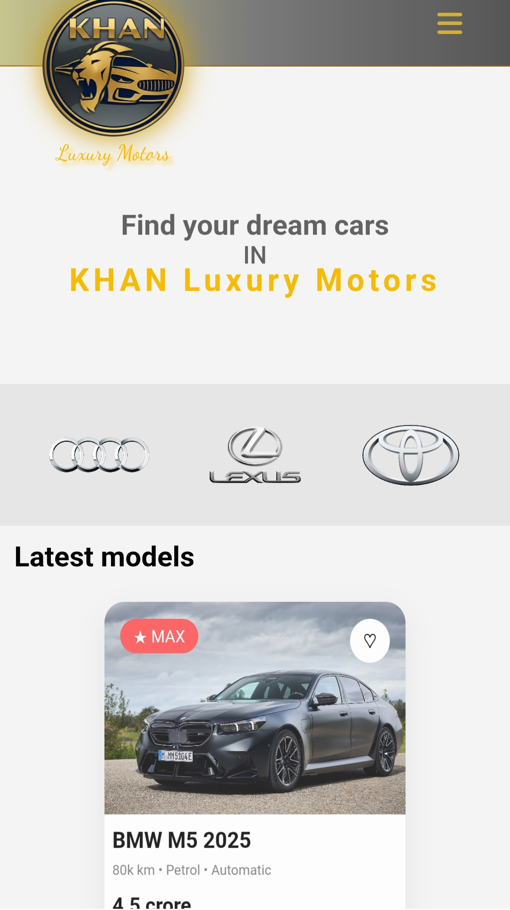
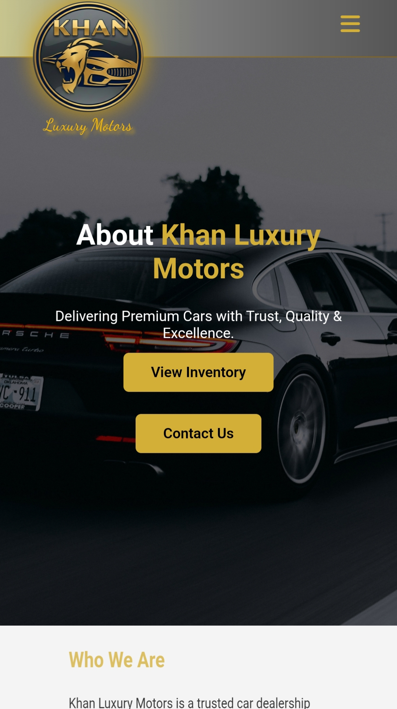
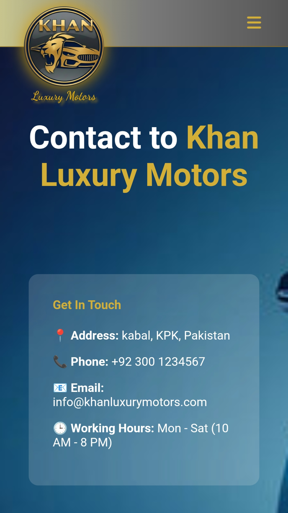

# Luxury Cars Website

This is a simple and clean 4-pages website about cars. I built this to practice my web development skills and show how to create a professional-looking site using only HTML and CSS.

[Click here to see the live site](https://luxury-cars-project.netlify.app/)

## Screenshots

### Desktop View

  
  
  
  

### Mobile View

  
  
  
  
  

## Main Features

- **4 Different pages:** Home, Cars Inventory, About Us and Contact page.

- **Mobile Friendly:** The website looks great on all screen (Laptops, Tablets and Mobile phones).

- **Modern Design:** clear layout with beautiful car images and easy-to-read text.

- **Navigation Menu:** A smooth menu to move between different pages easily.

## Tools I Used

- **HTML5:** To buil the structure of the pages.

- **CSS3:** To design the website, add colors, and make it responsive.

- **Font awesome:** Icon Library.

## How to Open locally

1.  Download the project files.
2.  Go to the project folder.
3.  Double-Click on the index.html file.
4.  The website will open in your browser!

## Developed BY:

[Muhammad Zeeshan Khan](https://github.com/mzeeshankhan-dev)